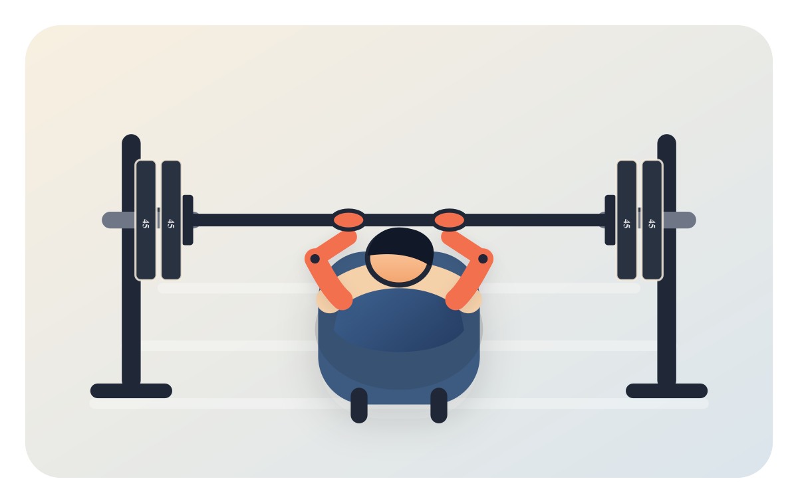
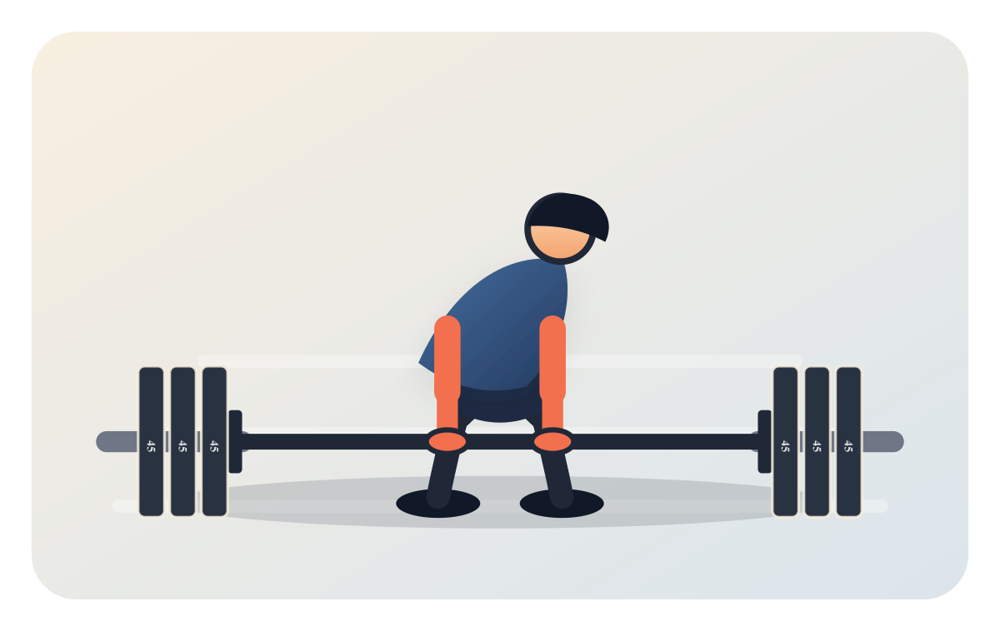
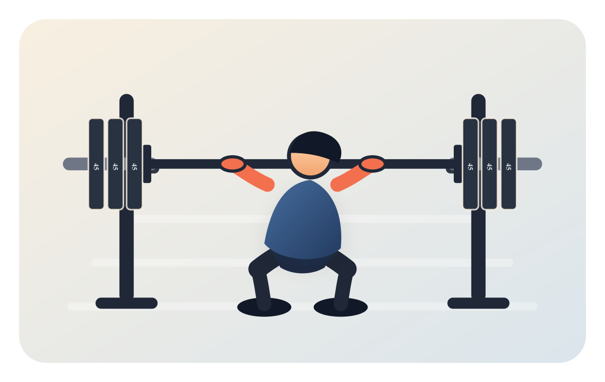

# RepRunner

RepRunner is a fitness side-quest app for logging lifts, visualizing barbell plate math, and eventually exploring running routes and training plans.

## Demo

| Bench press | Deadlift | Back squat |
| --- | --- | --- |
|  |  |  |

## Planned shape

- `apps/web`: the main React app
- `apps/api`: future backend for auth, workout logs, route helpers, and AI-flavored summaries
- `packages/lift-viz`: reusable lifting visualization components
- `packages/fitness-core`: shared fitness calculations and data models

## Local development

```bash
npm install
npm run dev
```
